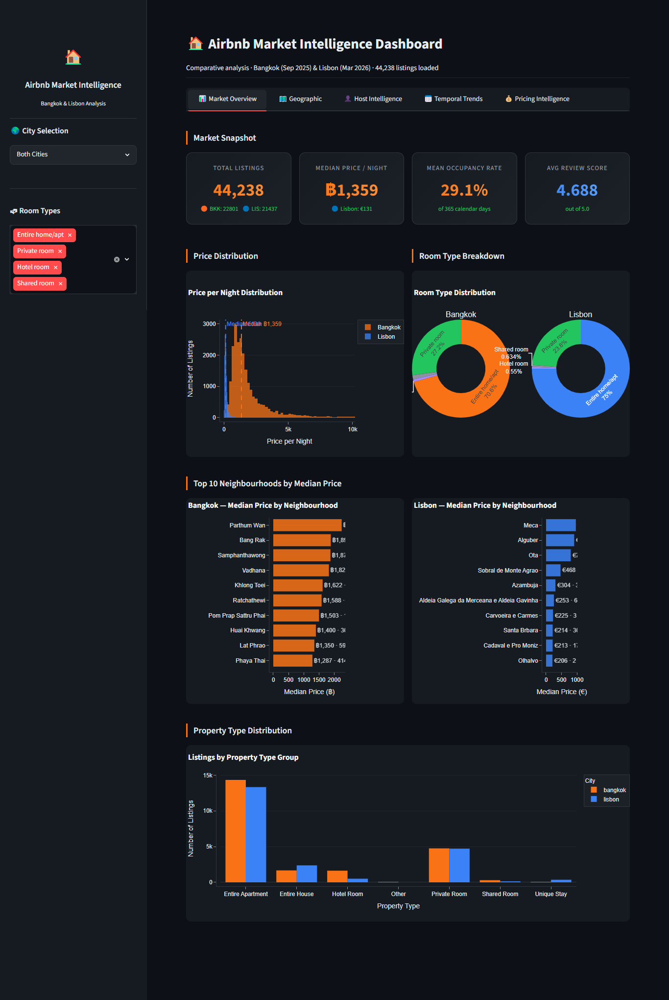
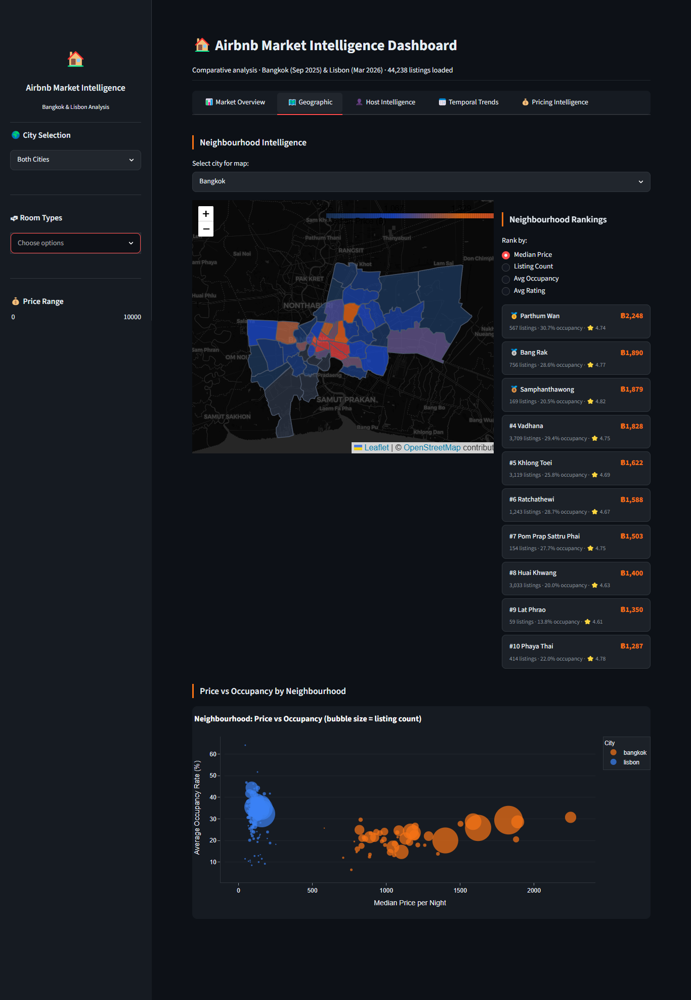
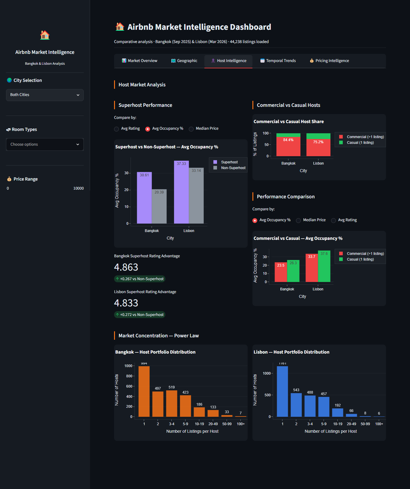

# Airbnb Market Intelligence System
### A Comparative Data Engineering & Analytics Study — Bangkok & Lisbon

---
## Overview

This repository contains a complete, production-style data engineering and analytics system built on Inside Airbnb data for two cities: Bangkok, Thailand and Lisbon, Portugal. The project spans the full data lifecycle — ingestion, profiling, cleaning, enrichment, dimensional modelling, statistical analysis, and interactive visualisation — orchestrated through a single configurable pipeline that can be run manually or via Apache Airflow.

**Start here, in this order:**
1. Read this README in full
2. Review `reports/Final_Report.pdf` — the primary analytical deliverable
3. Explore `notebooks/eda_bangkok_lisbon.ipynb` for the underlying analysis
4. Run `dashboard/app.py` for the interactive Streamlit dashboard
5. Review `pipeline/` for the engineering implementation

## 🔗 Quick Links

- **Live Dashboard:** - 

## 📸 Dashboard Screenshots

**Market Overview**


**Geographic Analysis**


**Host Intelligence**


**Temporal Trends**


**Pricing Intelligence**


---

## Repository Structure

```
airbnb-market-analytics-system/
│
├── airflow/
│   ├── dags/
│   │   └── airbnb_pipeline.py          # Airflow DAG definition
│   ├── logs/                            # Airflow task logs (gitignored)
│   ├── Dockerfile                       # Airflow container image
│   └── requirements.txt                 # Airflow container dependencies
│
├── data/
│   ├── raw/
│   │   ├── bangkok/                     # Raw Inside Airbnb files (not committed)
│   │   └── lisbon/
│   ├── processed/
│   │   ├── bangkok/                     # Cleaned & enriched CSVs
│   │   └── lisbon/
│   └── schemas/                         # Data profiling reports
│
├── pipeline/
│   ├── ingestion/
│   │   └── ingest_and_profile.py
│   ├── cleaning/
│   │   ├── clean_listings.py
│   │   ├── clean_reviews.py
│   │   ├── clean_calendar.py
│   │   └── clean_neighbourhoods.py
│   ├── enrichment/
│   │   └── enrich_listings.py
│   └── modeling/
│       └── load_star_schema.py
│
├── notebooks/
│   └── eda_bangkok_lisbon.ipynb         # EDA & statistical analysis notebook
│
├── dashboard/
│   └── app.py                           # Streamlit interactive dashboard
│
├── reports/
│   └── Final_Report.pdf                 # Full written report (mandatory deliverable)
│
├── run_pipeline.py                      # Master pipeline runner
├── docker-compose.yml                   # PostgreSQL + Airflow orchestration
├── .env.example                         # Environment variable template
├── requirements.txt                     # Project Python dependencies
└── README.md                            # This file
```

---

## Prerequisites

- Python 3.11+
- Docker Desktop (for PostgreSQL and Airflow)
- ~10 GB free disk space (calendar files are large — Bangkok's alone is ~700 MB raw)
- Recommended: Docker Desktop memory allocation of at least 6 GB (Settings → Resources → Memory)

---

## Setup Instructions

### 1. Clone the repository

```bash
git clone https://github.com/Imasha-Samarasinghe/Airbnb-Market-Analytics-System
cd airbnb-market-analytics-system
```

### 2. Create a Python virtual environment

```bash
python -m venv venv

# Windows
venv\Scripts\activate

# Mac/Linux
source venv/bin/activate
```

### 3. Install dependencies

```bash
pip install -r requirements.txt
```

### 4. Configure environment variables

Copy the example file and adjust if needed (defaults work for local Docker):

```bash
cp .env.example .env
```

`.env` contents:
```
DB_HOST=localhost
DB_PORT=5432
DB_NAME=airbnb_analytics
DB_USER=postgres
DB_PASSWORD=postgres
```

### 5. Start PostgreSQL (and optionally Airflow)

```bash
docker compose up -d
```

This starts:
- `airbnb_postgres` — the analytics database (always required)
- `airflow_webserver` + `airflow_scheduler` — optional orchestration UI at `http://localhost:8080` (login: `admin` / `admin`)

### 6. Download the raw data

Download the following files for each city from [insideairbnb.com/get-the-data](https://insideairbnb.com/get-the-data/) and place them in `data/raw/{city}/`:

```
data/raw/bangkok/listings.csv
data/raw/bangkok/calendar.csv
data/raw/bangkok/reviews.csv
data/raw/bangkok/neighbourhoods.geojson

data/raw/lisbon/listings.csv
data/raw/lisbon/calendar.csv
data/raw/lisbon/reviews.csv
data/raw/lisbon/neighbourhoods.geojson
```

Note: this project used the "detailed" listings.csv and reviews.csv (not the summary versions) to access full review text and extended listing attributes.

---

## Running the Pipeline

### Option A — Manual execution (recommended for first run)

Run the full pipeline for a single city:
```bash
python run_pipeline.py --city bangkok
```

Run both cities sequentially:
```bash
python run_pipeline.py --city bangkok lisbon
```

Run all configured cities:
```bash
python run_pipeline.py --city all
```

This executes, in order: ingestion & profiling → cleaning (listings, reviews, calendar, neighbourhoods) → enrichment → star schema load into PostgreSQL.

Expect this to take 30–90 minutes per city depending on machine specifications — the calendar files (9–10 million rows each) are the primary time cost, both during cleaning and during the PostgreSQL load step.

### Option B — Apache Airflow

With the Airflow containers running (`docker compose up -d`):

1. Open `http://localhost:8080` and log in (`admin` / `admin`)
2. Locate the `airbnb_market_pipeline` DAG
3. Click the play button to trigger a run, or click into the DAG and use the **Graph** view to inspect the task dependency structure

The DAG runs the identical underlying scripts as the manual runner — Airflow adds scheduling, retry logic, and a monitoring UI on top, with no duplicated logic.

### Adding a new city

The pipeline is designed to extend with minimal changes:

1. Place the four raw files in `data/raw/{new_city}/`
2. Add a `CITY_CONFIG` entry to both `pipeline/cleaning/clean_listings.py` and `pipeline/enrichment/enrich_listings.py`:
   ```python
   "new_city": {
       "scrape_date": pd.Timestamp("YYYY-MM-DD"),
       "currency": "£",
       "coord_bounds": {"lat": (min, max), "lon": (min, max)},
   }
   ```
3. Add the city name to `ALL_CITIES` in `run_pipeline.py`
4. Run `python run_pipeline.py --city new_city`

No other code changes are required. If new property types appear, the pipeline will log them explicitly — add them to `PROPERTY_TYPE_MAPPING` in `clean_listings.py` if desired.

---

## Verifying the Pipeline Ran Successfully

Check PostgreSQL directly:

```bash
docker exec -it airbnb_postgres psql -U postgres -d airbnb_analytics -c "SELECT city, COUNT(*) FROM fact_listings GROUP BY city;"
```

Or use pgAdmin (if added to your compose file) at `http://localhost:5050`.

A successful run for both cities should show approximately:
- Bangkok: 28,806 listings, 583K+ reviews, 10.5M calendar rows
- Lisbon: 24,950 listings, 1.83M+ reviews, 9.1M calendar rows

---

## Running the Dashboard

With PostgreSQL running and at least one city loaded:

```bash
streamlit run dashboard/app.py
```

Opens automatically at `http://localhost:8501`. The dashboard reads live from PostgreSQL and provides five tabs: Market Overview, Geographic (interactive choropleth maps), Host Intelligence, Temporal Trends, and Pricing Intelligence.

---

## Running the Analysis Notebook

```bash
jupyter notebook notebooks/eda_bangkok_lisbon.ipynb
```

The notebook connects directly to PostgreSQL and contains the full EDA and statistical analysis code referenced in the final report, including all hypothesis tests, the correlation matrix, and OLS regression.

---

## ✅ What Was Completed

- Full multi-city, configurable ingestion and profiling pipeline
- Data cleaning with city-specific handling of currency, coordinates, and schema differences between Bangkok and Lisbon
- 8-table star schema (5 dimensions, 3 facts) loaded into PostgreSQL, ~21 million rows total
- Complete EDA covering distributions, geography, temporal trends, host analysis, and review patterns
- 5 hypothesis tests with non-parametric methods, effect sizes, and OLS regression with VIF diagnostics
- Interactive 5-tab Streamlit dashboard with live PostgreSQL querying and cross-filtering
- Apache Airflow DAG for pipeline orchestration
- Full Docker containerisation

## ⏭ What Was Not Completed

Sections 06 (Data Science/ML) and 07 (AI/ML Opportunities) of the assessment were deliberately not attempted, in favour of achieving depth across the data engineering and analytical sections. Rationale is documented in the report's Objectives & Scope and Limitations sections.
